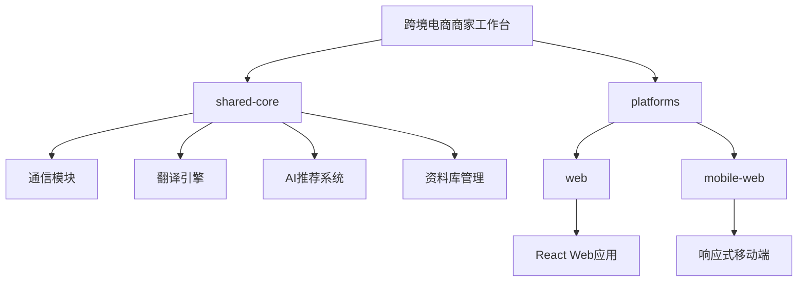

# 跨境电商平台商家沟通工作台

## 项目概述

跨境电商平台商家沟通工作台是一个面向跨境电商卖家的工具，旨在提升卖家与全球买家的沟通效率。系统默认使用英文作为界面语言，并提供实时翻译功能，帮助卖家与不同国家的买家进行无障碍沟通。

## 多平台支持

| 平台          | 技术栈         | 注意事项                     |
|--------------|---------------|----------------------------|
| 网页          | Next.js/React | 响应式设计，支持桌面和移动端    |
| 移动端网页     | Next.js/React | 针对触摸操作优化的界面         |

## 功能模块

### 1. 买卖家沟通功能

- **买家列表与对话框**
  - 左侧展示买家列表，包含头像、名称、国家、最后消息预览、未读消息数
  - 中间展示当前选中买家的对话框
  - 实时翻译功能：
    - 买家消息下方自动翻译为英语
    - 商家英语回复下方自动翻译为买家所在国家语言
  
- **买家信息侧边栏**
  - 展示当前买家采购信息（采购内容、数量、目的国）
  - 显示沟通重点（如质量关注点、供货稳定性需求等）
  - AI推荐商品卡片，可一键发送给买家

### 2. 资料库页面

- 允许商家上传自定义资料
- 支持客服AI agent基于这些资料进行自动问答
- 资料分类管理

### 3. AI客服设置

- 客服agent开关控制
- 买家诉求问题定制（商家可选择具体问题）

## 页面规划

### 1. 主导航结构
- **顶部导航栏**：Logo、页面切换、用户信息、语言设置
- **侧边导航**：主要功能区域切换

### 2. 页面布局
#### 2.1 沟通工作台页面（主页面）
- **三栏布局**：
  - 左侧：买家列表（20%宽度）
  - 中间：聊天对话框（50%宽度）
  - 右侧：买家信息与推荐（30%宽度）

#### 2.2 资料库页面
- **两栏布局**：
  - 左侧：资料分类导航（30%宽度）
  - 右侧：资料上传与管理区域（70%宽度）

#### 2.3 AI设置页面
- 单栏布局，包含各种AI相关设置选项

### 3. 组件规划
- **买家列表组件**：展示头像、名称、国家、最后消息预览、未读消息数
- **聊天组件**：消息气泡、翻译结果、时间戳、输入框、快捷回复
- **买家信息卡片**：采购信息、沟通重点、标签
- **商品推荐卡片**：图片、名称、价格、库存、一键发送按钮
- **资料上传组件**：拖拽上传、文件列表、分类管理
- **AI设置面板**：开关控件、问题选择器、自定义问题输入

## 技术栈

- **前端框架**: Next.js 15.2.2, React 19
- **样式**: TailwindCSS 4
- **语言**: TypeScript
- **状态管理**: Zustand
- **国际化**: i18next
- **UI组件库**: 自定义组件 + Ant Design
- **路由管理**: Next.js App Router
- **数据模拟**: MSW (Mock Service Worker)

## 多平台架构设计



## 开发指南

### 安装依赖

```bash
npm install
```

### 启动开发服务器

```bash
npm run dev
```

### 构建生产版本

```bash
npm run build
```

### 启动生产服务器

```bash
npm run start
```

## 项目结构

```
├─ src/
│  ├─ app/                  # Next.js应用目录
│  │  ├─ page.tsx           # 主页面
│  │  ├─ layout.tsx         # 布局组件
│  │  ├─ globals.css        # 全局样式
│  │  ├─ chat/              # 聊天页面
│  │  ├─ resources/         # 资料库页面
│  │  └─ settings/          # AI设置页面
│  ├─ components/           # 共享组件
│  │  ├─ BuyerList/         # 买家列表组件
│  │  ├─ ChatBox/           # 聊天框组件
│  │  ├─ BuyerInfo/         # 买家信息组件
│  │  ├─ ProductCard/       # 商品卡片组件
│  │  └─ Navigation/        # 导航组件
│  ├─ shared-core/          # 跨平台共享代码
│  │  ├─ api/               # API接口定义
│  │  ├─ translation/       # 翻译逻辑
│  │  ├─ ai-engine/         # AI推荐和问答引擎
│  │  └─ utils/             # 通用工具函数
│  └─ mock/                 # 模拟数据
│     ├─ buyers.ts          # 买家数据
│     ├─ messages.ts        # 消息数据
│     └─ products.ts        # 商品数据
└─ public/                  # 静态资源
```

## 实现计划

1. **项目初始化**
   - 创建Next.js项目，配置TypeScript和TailwindCSS
   - 设置基础目录结构和路由

2. **核心功能实现**
   - 实现买家列表和聊天界面
   - 添加模拟翻译功能
   - 构建买家信息侧边栏

3. **AI功能集成**
   - 实现商品推荐卡片
   - 添加AI设置页面
   - 模拟AI问答功能

4. **资料库页面**
   - 实现资料上传和管理界面
   - 添加资料分类功能

5. **响应式适配**
   - 优化移动端布局
   - 测试不同设备尺寸

6. **完善与优化**
   - 添加动画和交互效果
   - 优化性能和用户体验

## 注意事项

- 本项目为Demo性质，使用模拟数据展示功能，无需实现后端存储和复杂逻辑
- 主要为Web端设计，但需要良好的移动端适配

This is a [Next.js](https://nextjs.org) project bootstrapped with [`create-next-app`](https://nextjs.org/docs/app/api-reference/cli/create-next-app).

## Getting Started

First, run the development server:

```bash
npm run dev
# or
yarn dev
# or
pnpm dev
# or
bun dev
```

Open [http://localhost:3000](http://localhost:3000) with your browser to see the result.

You can start editing the page by modifying `app/page.tsx`. The page auto-updates as you edit the file.

This project uses [`next/font`](https://nextjs.org/docs/app/building-your-application/optimizing/fonts) to automatically optimize and load [Geist](https://vercel.com/font), a new font family for Vercel.

## Learn More

To learn more about Next.js, take a look at the following resources:

- [Next.js Documentation](https://nextjs.org/docs) - learn about Next.js features and API.
- [Learn Next.js](https://nextjs.org/learn) - an interactive Next.js tutorial.

You can check out [the Next.js GitHub repository](https://github.com/vercel/next.js) - your feedback and contributions are welcome!

## Deploy on Vercel

The easiest way to deploy your Next.js app is to use the [Vercel Platform](https://vercel.com/new?utm_medium=default-template&filter=next.js&utm_source=create-next-app&utm_campaign=create-next-app-readme) from the creators of Next.js.

Check out our [Next.js deployment documentation](https://nextjs.org/docs/app/building-your-application/deploying) for more details.
