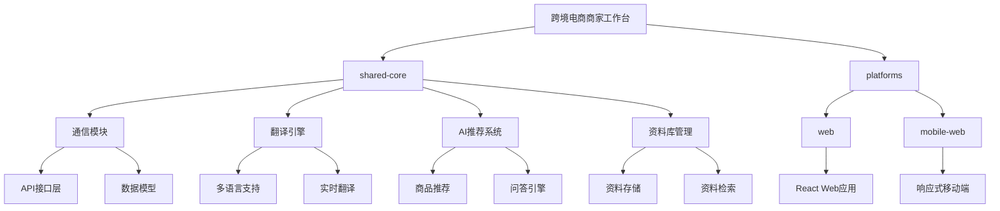
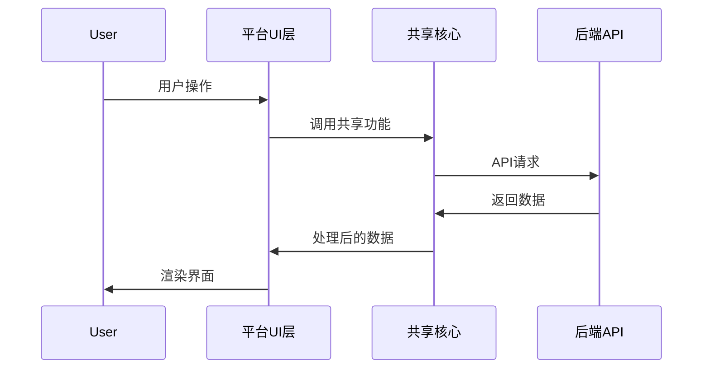

# 跨境电商平台商家沟通工作台 - 多平台架构设计

## 架构概述

跨境电商平台商家沟通工作台采用模块化、分层的架构设计，确保核心业务逻辑可以在不同平台上复用，同时针对各平台特性进行优化。

## 多平台架构图

## 模块说明

### 1. 共享核心 (shared-core)

共享核心包含所有平台共用的业务逻辑和数据处理功能，确保跨平台一致性。

#### 1.1 通信模块 (api)

- **功能**: 处理与后端API的通信，封装请求和响应处理
- **跨平台策略**: 
  - Web端使用标准Fetch API
  - 移动端适配使用相同接口但针对触摸操作优化

#### 1.2 翻译引擎 (translation)

- **功能**: 提供实时消息翻译功能
- **跨平台策略**:
  - 所有平台共用相同的翻译逻辑
  - 针对不同平台的网络状况优化缓存策略

#### 1.3 AI推荐系统 (ai-engine)

- **功能**: 提供商品推荐和自动问答功能
- **跨平台策略**:
  - 核心算法逻辑共享
  - 界面呈现根据平台特性调整

#### 1.4 资料库管理 (utils)

- **功能**: 管理商家上传的资料，提供存储和检索功能
- **跨平台策略**:
  - 统一的资料管理接口
  - 针对移动端优化文件上传和预览体验

### 2. 平台层 (platforms)

平台层负责将共享核心的功能适配到特定平台的UI和交互模式。

#### 2.1 Web端 (web)

- **技术栈**: Next.js, React, TailwindCSS
- **特性**:
  - 完整功能支持
  - 响应式设计，支持桌面浏览器
  - 高级数据可视化

#### 2.2 移动端Web (mobile-web)

- **技术栈**: Next.js, React, TailwindCSS (移动优化)
- **特性**:
  - 触摸优化界面
  - 简化的数据展示
  - 性能优化，减少资源占用

## 跨平台数据流

## 平台适配策略

### 响应式设计

- 使用TailwindCSS的响应式类
- 针对不同屏幕尺寸优化布局
- 移动端优先的设计理念

### 性能优化

- Web端: 代码分割，懒加载
- 移动端: 减少JavaScript包体积，优化图片加载

### 平台特定功能

- Web端: 支持键盘快捷键，高级数据筛选
- 移动端: 触摸手势，简化操作流程

## 开发指南

### 添加新功能的跨平台流程

1. 在shared-core中实现核心业务逻辑
2. 为Web端创建组件，实现完整功能
3. 为移动端Web适配组件，优化触摸体验
4. 编写单元测试，确保跨平台一致性

### 代码规范

- 所有共享逻辑必须放在shared-core目录
- 平台特定代码必须在platforms目录下对应平台子目录中
- 使用TypeScript接口确保跨平台类型安全 